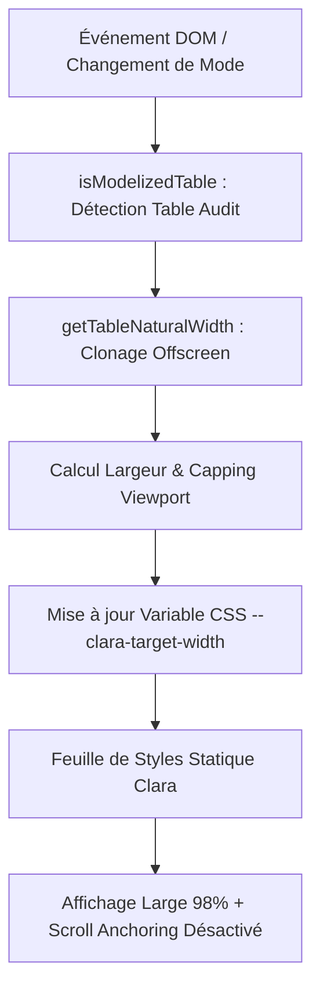

# MÉMO TECHNIQUE D'ACTUALISATION : VISUALISATION, PROBLÈMES RÉSOLUS & SOLUTIONS
## Mode Écran (Wide Screen / Middle Screen / Normal Screen) & Extension Harmonieuse des Tables d'Audit

> **Date** : 27 Août 2026  
> **Auteur** : Architecte UI Front-End Senior  
> **Dossier** : `Doc fullscreen-extension-v8`  
> **Fichier** : `memo_actualisation_visualisation_solutions.md`  
> **Statut** : ✅ Validé & en production (0 erreurs TypeScript)  

---

## 1. Synthèse de la Visualisation Actualisée

La dernière version stabilise et harmonise l'affichage plein écran sur l'ensemble de l'interface :

1. **Expansion Optimale des Tables d'Audit** :
   * Les tables modélisées (feuilles de travail, tests de rapprochement, tables de consolidation avec 18+ colonnes comme `(A)` à `(I)`, `CTR 1-3`, `Description`, `Conclusion`) s'étendent de manière fluide sur **98% de la largeur utile de l'écran**.
   * Les colonnes de droite cruciales (*Description*, *Conclusion*) disposent d'un espace dédié et ne sont plus coupées.
   * La bordure droite de chaque table reste nette et visible avec une marge interne de sécurité (`padding-right: 10px`).

2. **Réduction Optimisée des Retraits de 60%** :
   * **Padding extérieur du conteneur de chat** : Réduit de 24px (`p-6`) à **10px** (-60%).
   * **Padding intérieur de la bulle de message** : Réduit de 20px (`px-5`) à **10px** (-50/60%).
   * **Marge latérale globale** : Réduite à 14px total (7px de chaque côté).

3. **Cohérence Visuelle & Symétrie Préservées** :
   * **Avatar & en-tête intacts** : L'avatar de l'assistant conserve ses proportions rondes standards (32px / `w-8 h-8`), avec un espacement propre (`gap: 8px`).
   * **Bulles utilisateur** : Restent élégamment alignées à droite sans être déformées ni étirées de manière disproportionnée.
   * **Barre de saisie `/Demarrer E-audit pro`** : Reste parfaitement centrée et symétrique en bas de l'écran.

---

## 2. Historique des Problèmes Rencontrés & Causes Racines

| Problème identifié | Symptôme visuel | Cause racine technique |
| :--- | :--- | :--- |
| **1. Débordement du viewport global** | La barre haute (Topbar) et la Sidebar disparaissaient vers la gauche lors du défilement horizontal. | Largeur brute injectée sans plafonnement sur le viewport utilisateur (`window.innerWidth`). Défilement horizontal non restreint au niveau `html, body`. |
| **2. Saut de scroll vers le haut (*Scroll Jump*)** | Lors du défilement vers le bas près de la dernière table, la vue remontait brutalement plus haut. | L'algorithme de *Scroll Anchoring* du navigateur s'activait lors de chaque mutation DOM du `MutationObserver` ou lors de la modification de styles inline sur la table live. |
| **3. Tronquage prématuré à 1200px** | Des espaces blancs immenses persistaient à droite de l'écran et les dernières colonnes étaient masquées. | Lecture de `table.scrollWidth` sur la table contrainte dans le DOM (qui renvoyait la largeur réduite du parent `896px`/`1200px` au lieu de la largeur réelle non compressée). |
| **4. Dérèglement visuel lors de réductions excessives** | Avatars microscopiques déformés, bulles utilisateur étirées anormalement, suppression complète des marges de lisibilité. | Règles CSS trop agressives ciblant globalement les éléments d'avatar et supprimant tous les paddings structurels. |

---

## 3. Architecture Technique des Solutions Implémentées

Le fichier [`src/utils/screenManager.ts`](file:///h:/ClaraVerse/src/utils/screenManager.ts) centralise l'ensemble de la logique en respectant les 4 piliers suivants :



### A. Mesure Non-Intrusive Hors-Écran (`getTableNaturalWidth`)
Pour connaître la largeur exacte dont une table a besoin sans perturber le DOM live :
```typescript
function getTableNaturalWidth(table: HTMLTableElement): number {
  try {
    const clone = table.cloneNode(true) as HTMLTableElement;
    clone.style.position = 'fixed';
    clone.style.visibility = 'hidden';
    clone.style.pointerEvents = 'none';
    clone.style.width = 'max-content';
    clone.style.maxWidth = 'none';
    clone.style.tableLayout = 'auto';
    clone.style.top = '-9999px';
    clone.style.left = '-9999px';
    clone.style.zIndex = '-1000';
    document.body.appendChild(clone);
    const measuredWidth = clone.scrollWidth || clone.offsetWidth || Math.ceil(clone.getBoundingClientRect().width);
    document.body.removeChild(clone);
    return Math.max(measuredWidth, 1200);
  } catch (e) {
    return table.scrollWidth || 1200;
  }
}
```

### B. Plafonnement Sécurisé et Gestion des 3 Modes
```typescript
// 1. Calcul de la largeur avec buffer
const neededWidth = maxNaturalWidth + 40;

// 2. Limite physique de l'écran avec 14px de marge totale
const viewportWidth = window.innerWidth || document.documentElement.clientWidth || 1920;
const maxSafeViewportWidth = Math.max(800, viewportWidth - 14);

// 3. Base cible
const baseTargetWidth = maxTableNaturalWidth > 0 
  ? Math.max(maxTableNaturalWidth, 1400)
  : maxSafeViewportWidth;

// 4. Multiplicateurs des modes
// Wide Screen = 1.0 | Middle Screen = 0.9 | Normal Screen = Restauration native
const rawTargetWidth = Math.round(baseTargetWidth * widthMultiplier);
const effectiveWidth = Math.min(rawTargetWidth, maxSafeViewportWidth);

// 5. Application sans reflow inutile
if (currentAppliedTargetWidth !== effectiveWidth) {
  currentAppliedTargetWidth = effectiveWidth;
  document.body.style.setProperty('--clara-target-width', `${effectiveWidth}px`);
}
```

### C. Éradication du Saut de Scroll (Scroll Anchoring & User-Scroll Guard)
```css
/* Désactive l'ancrage automatique du scroll qui provoquait les remontées de vue */
body[data-clara-screen-mode="wide"] .flex-1.overflow-y-auto,
body[data-clara-screen-mode="wide"] .flex-1.overflow-y-auto * {
  overflow-anchor: none !important;
}

/* Verrouille le défilement horizontal sur le document entier pour garder la Topbar fixe */
html, body {
  overflow-x: hidden !important;
}
```
* **User-Scroll Guard** : Les événements de scroll utilisateur mettent en pause les déclenchements du `MutationObserver` pendant 800ms pour garantir une fluidité totale.

### D. Règles de Retraits & Harmonie Visuelle
```css
/* Conteneur principal élargi à 98% */
body[data-clara-screen-mode="wide"] [data-widescreen-target="container"] {
  max-width: var(--clara-target-width) !important;
  width: 98% !important;
  margin-left: auto !important;
  margin-right: auto !important;
  box-sizing: border-box !important;
  transition: max-width 0.25s ease-out;
}

/* Espacement avatar / bulle harmonieux */
body[data-clara-screen-mode="wide"] .flex.gap-4:has([data-widescreen-target="bubble"]) {
  gap: 8px !important;
}

/* Bulle intérieure : retraits réduits de 60% pour maximiser la largeur utile */
body[data-clara-screen-mode="wide"] [data-widescreen-target="bubble-inner"] {
  width: 100% !important;
  max-width: 100% !important;
  padding-left: 10px !important;
  padding-right: 10px !important;
  box-sizing: border-box !important;
  overflow-x: auto !important;
}

/* Défilement autonome et padding de la dernière colonne */
body[data-clara-screen-mode="wide"] .prose div:has(> table) {
  max-width: 100% !important;
  width: 100% !important;
  overflow-x: auto !important;
  box-sizing: border-box !important;
  padding-right: 8px !important;
  scrollbar-width: thin !important;
}

body[data-clara-screen-mode="wide"] .prose table th:last-child,
body[data-clara-screen-mode="wide"] .prose table td:last-child {
  border-right-width: 1px !important;
  padding-right: 10px !important;
}
```

---

## 4. Guide de Maintenance pour les Développeurs / Agents IA

1. **Ne jamais modifier les styles inline des `<table>` en direct dans le DOM** : Utiliser impérativement la fonction `getTableNaturalWidth()` qui opère sur un clone détaché.
2. **Ne jamais réinjecter `<style>` à chaque mutation** : Conserver la feuille de style statique injectée une seule fois via `ensureStyleTagInjected()` et modifier uniquement la variable CSS `--clara-target-width`.
3. **Conserver `overflow-anchor: none !important;`** : Sur `.flex-1.overflow-y-auto` et tous ses enfants pour éviter toute régression de défilement saccadé.
4. **Maintenir la synchronisation des 3 modes** : Tout ajout de mode doit s'enregistrer dans `localStorage` sous la clé `'clara-screen-mode'` et émettre l'événement `CustomEvent('clara-screen-mode-changed')`.

---

## 5. Synthèse des Fichiers Clés

* [`src/utils/screenManager.ts`](file:///h:/ClaraVerse/src/utils/screenManager.ts) : Moteur central de calcul, détection et injection CSS.
* [`src/components/ScreenSelector.tsx`](file:///h:/ClaraVerse/src/components/ScreenSelector.tsx) : Sélecteur UI dans la Topbar (Modes Wide 🔵, Middle 🟠, Normal ⚫).
* [`src/components/Clara_Components/clara_assistant_chat_window.tsx`](file:///h:/ClaraVerse/src/components/Clara_Components/clara_assistant_chat_window.tsx) : Conteneur de chat avec cible `[data-widescreen-target="container"]`.
* [`src/components/Clara_Components/clara_assistant_message_bubble.tsx`](file:///h:/ClaraVerse/src/components/Clara_Components/clara_assistant_message_bubble.tsx) : Structure des bulles de messages avec `[data-widescreen-target="bubble-inner"]`.
